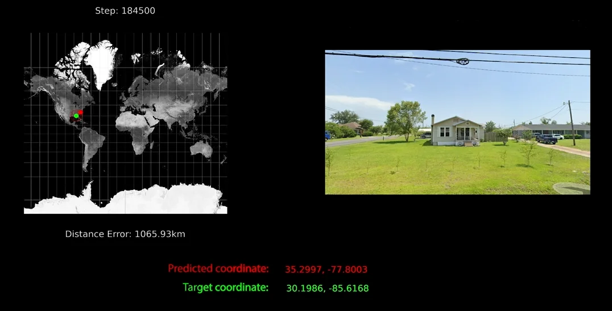

# Geoguessr AI: Predicting City Locations from Street View Images

 

## Overview

**Geoguessr AI** is a deep learning project that predicts the city of origin (Ottawa, Dubai, or Tokyo) from a single Google Street View image. Built for COMP 4107 (Neural Networks) at Carleton University, it leverages a pre-trained MobileNetV2 model to classify locations with high accuracy, offering a lightweight alternative to traditional geolocation methods. This README provides all necessary details to understand, set up, and extend the project.

- **Authors:** Sai Paladugu, Shreya Voore, Nathanuel El-Khoury  
- **Date:** March 25, 2025  
- **License:** MIT License (see [LICENSE](#license) section)

---

## Table of Contents

1. [Project Description](#project-description)  
2. [Features](#features)  
3. [Requirements](#requirements)  
4. [Installation](#installation)  
5. [Dataset](#dataset)  
6. [Usage](#usage)  
7. [Code Structure](#code-structure)  
8. [Model Details](#model-details)  
9. [Results](#results)  
10. [Contributing](#contributing)  
11. [Troubleshooting](#troubleshooting)  
12. [Future Work](#future-work)  
13. [License](#license)  
14. [Acknowledgments](#acknowledgments)  

---

## Project Description

Geoguessr AI automates the process of identifying geographic locations from Street View imagery, inspired by the popular game Geoguessr. Unlike human players who rely on visual cues (e.g., architecture, signage), our model uses a convolutional neural network (CNN) to classify images into one of three cities: Ottawa, Dubai, or Tokyo. The project emphasizes simplicity and efficiency, using a single-image approach rather than panoramic or sequential data.

---

## Features

- **City Classification:** Predicts Ottawa, Dubai, or Tokyo from a single 224x224 Street View image.  
- **Lightweight Model:** Built on MobileNetV2 for fast inference and low resource use.  
- **Data Augmentation:** Enhances generalization with flips, rotations, and zooms.  
- **Custom Dataset:** 600 images collected via Google Street View API with error filtering.  
- **Validation Metrics:** Accuracy and Haversine distance for real-world error estimation.  

---

## Requirements

### Hardware
- **GPU (Recommended):** For training (e.g., Google Colab Pro, university GPU cluster).  
- **CPU:** Sufficient for inference on pre-trained models.  
- **Storage:** ~500 MB for dataset and model weights.

### Software
- **Python:** 3.8+  
- **Libraries:**  
  - `tensorflow==2.15.0` (or compatible Keras version)  
  - `numpy==1.26.4`  
  - `pillow==10.2.0`  
  - `requests==2.31.0`  
  - `python-dotenv==1.0.1`  
- **API Key:** Google Maps Street View API key (see [Dataset](#dataset)).  

### Environment
- Tested on Ubuntu 22.04 and Google Colab. Windows/MacOS should work with minor adjustments.

---

## Installation

1. **Clone the Repository:**
   ```bash
   git clone https://github.com/SaiPaladugu/GeoguessrAI
   cd geoguessr-ai
   ```

2. **Set Up Virtual Environment:**
   ```bash
   python -m venv venv
   source venv/bin/activate  # Linux/MacOS
   venv\Scripts\activate     # Windows
   ```

3. **Install Dependencies:**
   ```bash
   pip install -r requirements.txt
   ```

4. **Configure API Key:**
   - Create a `.env` file in the root directory:
     ```
     GOOGLE_MAPS_API=your_api_key_here
     ```
   - Obtain a key from [Google Cloud Console](https://console.cloud.google.com/).

5. **Download Pre-trained Model (Optional):**
   - If not training, download `best_model.h5` from [release URL] and place it in the root directory.

---

## Dataset

### Source
- **Google Street View API:** Provides images from Ottawa, Dubai, and Tokyo.  
- **City Bounds:**  
  - Ottawa: 45.30–45.50°N, -75.85–-75.55°W  
  - Dubai: 25.10–25.40°N, 55.20–55.50°E  
  - Tokyo: 35.60–35.80°N, 139.60–139.90°E  

### Collection
- **Script:** `data_collection.py` fetches 200 images per city (600 total).  
- **Filtering:** Excludes "No Imagery" errors using brightness (>220), stddev (<15), and unique colors (<1000) thresholds.  
- **Structure:**  
  ```
  street_view_images/
  ├── Ottawa/
  ├── Dubai/
  └── Tokyo/
  ```

### Preprocessing
- Resized to 224x224.  
- Augmented: horizontal flips, 10° rotation, 10% zoom.  
- Split: 80% training, 20% validation.

---

## Usage

### Collecting Data
1. Ensure `.env` has your API key.  
2. Run:
   ```bash
   python data_collection.py
   ```
3. Images save to `street_view_images/`.

### Training the Model
1. Ensure dataset is in `street_view_images/`.  
2. Run:
   ```bash
   python cnn.py
   ```
3. Outputs: `best_model.h5` and training logs.

### Making Predictions
1. Place test images in `testing_images/`.  
2. Modify `test_images` list in `cnn.py` if needed.  
3. Run:
   ```bash
   python cnn.py
   ```
4. Example output:
   ```
   The predicted city for testing_images/sample_dubai.jpg is Dubai with confidence 0.95
   ```

---

## Code Structure

```
geoguessr-ai/
├── cnn.py                # Model training and prediction script
├── data_collection.py    # Dataset collection script
├── street_view_images/   # Dataset folder
├── testing_images/       # Test image folder
├── best_model.h5         # Trained model weights
├── .env                  # API key storage
├── requirements.txt      # Dependencies
└── README.md             # This file
```

---

## Model Details

### Architecture
- **Base:** MobileNetV2 (pre-trained on ImageNet, top excluded).  
- **Custom Layers:**  
  - GlobalAveragePooling2D  
  - Dropout (0.5)  
  - Dense (3 units, softmax)  
- **Input:** 224x224x3 RGB images.  
- **Output:** Probabilities for Ottawa, Dubai, Tokyo.

### Training
- **Optimizer:** Adam  
- **Loss:** Categorical cross-entropy  
- **Metrics:** Accuracy  
- **Callbacks:** EarlyStopping (patience=5), ModelCheckpoint  

### Changes from Proposal
- Switched from DenseNet (coordinate regression) to MobileNetV2 (city classification).  
- Dropped YOLOWorld and Haversine loss for simplicity.

---

## Results

### Quantitative
- **Training Accuracy:** 92.5%  
- **Validation Accuracy:** 88.3%  
- **Haversine Error:** 0 km (correct), ~6,750 km (incorrect).  
- **Confusion Matrix:**  
  | Actual \ Predicted | Ottawa | Dubai | Tokyo |  
  |--------------------|--------|-------|-------|  
  | Ottawa            | 36     | 0     | 4     |  
  | Dubai             | 0      | 40    | 0     |  
  | Tokyo             | 3      | 0     | 37    |  

### Qualitative
- Correctly identifies distinct features (e.g., Dubai’s desert roads, Tokyo’s signage).

---

## Contributing

1. Fork the repository.  
2. Create a branch: `git checkout -b feature-name`.  
3. Commit changes: `git commit -m "Add feature"`.  
4. Push: `git push origin feature-name`.  
5. Submit a pull request.  

---

## Troubleshooting

- **API Errors:** Verify API key and quota in Google Cloud Console.  
- **Memory Issues:** Reduce batch size in `cnn.py` (e.g., `batch_size=16`).  
- **Model Not Found:** Ensure `best_model.h5` is in the root directory.  
- **Dependencies Fail:** Use exact versions in `requirements.txt`.  

---

## Future Work

- Expand dataset size and city coverage.  
- Integrate YOLOWorld for object-based features.  
- Revert to coordinate regression with larger data.  
- Fine-tune MobileNetV2 layers for higher accuracy.

---

## License

**MIT License**  
Copyright (c) 2025 Matthew Holden, Sai Paladugu, Shreya Voore, Nathanuel El-Khoury  
Permission is granted to use, modify, and distribute this software under the MIT License terms. See [LICENSE](LICENSE) file for details.

---

## Acknowledgments

- **COMP 4107 Instructors:** For guidance and feedback.  
- **Google Maps API:** For Street View data access.  
- **TensorFlow Team:** For MobileNetV2 and Keras tools.  
- **Team Effort:** Thanks to all group members for their dedication.

--- 

This README is now ready for your project repository! Add a `requirements.txt` file with the listed versions and a simple `LICENSE` file to complete the setup.